# Project Slayer — Boss & Chest Drops

Pulled from the live client on 2026-09-24 (Ouwland, place `136406881576517`), from the same tables the in-game item viewer reads: `LiveConfig.get("NpcDataTable")` and `LiveConfig.get("ChestsLootTable")` in `ReplicatedStorage.CAM.Global.LiveConfig`.

**How to read it**

- **Chance** is the roll per kill or per chest opened. A chest's chances add up to 41%–311%, so each item seems to roll on its own (inferred — the roll happens on the server).
- **Pity N**: the skill is probably guaranteed by kill N if it hasn't dropped yet (config field `Pity`).
- **Lv N**: config field `Level` on the drop, most likely the minimum player level to receive it.
- **Unboosted**: luck boosts don't apply to that roll.
- Rarity: ⬜ Common · 🟩 Uncommon · 🟦 Rare · 🟪 Epic · 🟨 Legendary · 🟥 Mythic · ⬛ Impossible

**Contents:** [Bosses](#bosses) · [Mob drops](#mob-drops) · [Chests](#chests) · [Where to get an item](#where-to-get-an-item)

## Bosses

### World bosses

| | Boss | HP | Respawn | Exp / Wen | Chest | Drops |
|:-:|---|--:|--:|--:|---|---|
|  | **Akazo** The Shockwave Demon | 3000 | 300s | 1000 / 450 | 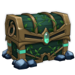 [World Events Chest](#world-events-chest) |  Annihilation Type — **10%** (skill · pity 35) 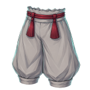 Akazo's Bottom — **5%** 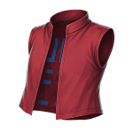 Akazo's Top — **5%** |
| 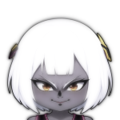 | **Datai** The Obi Demon | 3000 | 300s | 1000 / 450 |  [World Events Chest](#world-events-chest) |  Obi Charge — **10%** (skill · pity 35) 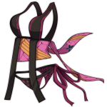 Datai's Outfit — **5%** 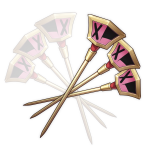 Golden Kanzashi — **5%** |
|  | **Domae** The Cryokinetic Demon 🌙 night only | 3000 | 300s | 1000 / 450 |  [World Events Chest](#world-events-chest) |  Bodhisattva — **10%** (skill · pity 35) 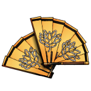 War Fans — **7%** 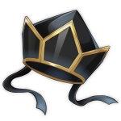 Black Lotus Crown — **5%** 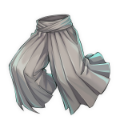 Domae's Bottom — **5%** 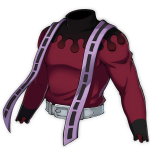 Domae's Top — **5%** |
|  | **Enru** The Dream Demon | 3000 | 300s | 1000 / 450 |  [World Events Chest](#world-events-chest) |  Flesh Monster — **10%** (skill · pity 35) 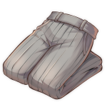 Enru's Bottom — **5%**  Enru's Top — **5%** |
|  | **Giyen** The Water Hashira | 3000 | 300s | 1000 / 450 |  [World Events Chest](#world-events-chest) |  Dead Calm — **10%** (skill · pity 35) 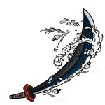 Water Katana — **5%** 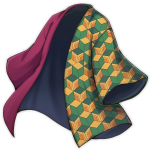 Water Haori — **3%** |
| 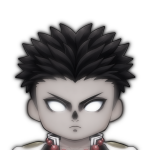 | **Gyorei** The Stone Hashira | 3000 | 300s | 1000 / 450 |  [World Events Chest](#world-events-chest) |  Arcs of Justice — **10%** (skill · pity 35) 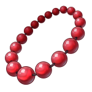 Stone Necklace — **5%** 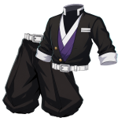 Stone Slayer Uniform — **5%** 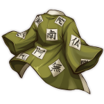 Stone Haori — **3%** |
| 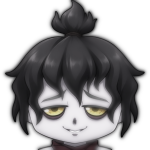 | **Gyutai** The Blood Sickle Demon | 3000 | 300s | 1000 / 450 |  [World Events Chest](#world-events-chest) |  Circular Slashes — **10%** (skill · pity 35)  Blood Sickles — **7%** 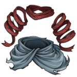 Gyutai's Outfit — **5%** |
| 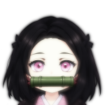 | **Nezura** The Pyrokinetic Demon | 3000 | 300s | 1000 / 450 |  [World Events Chest](#world-events-chest) |  Blood Rupture — **10%** (skill · pity 35) 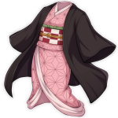 Nezura's Outfit — **5%** 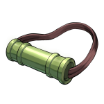 Bamboo Muzzle — **3%** |
| 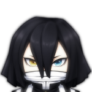 | **Obari** The Serpent King | 3000 | 300s | 1000 / 450 |  [World Events Chest](#world-events-chest) |  Slithering Serpent — **10%** (skill · pity 35) 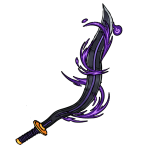 Serpent Katana — **5%** 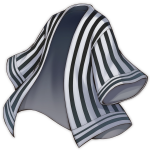 Serpent Haori — **3%** |
|  | **Reaper** Sonic Reaper Demon 🌙 night only | 3000 | 300s | 1000 / 450 |  [World Events Chest](#world-events-chest) |  Sonido Surge — **10%** (skill · pity 35) 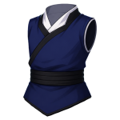 Reaper’s Outfit — **3%** |
| 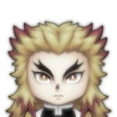 | **Rengu** The Flame Hashira | 3000 | 300s | 1000 / 450 |  [World Events Chest](#world-events-chest) |  Purgatory — **10%** (skill · pity 35) 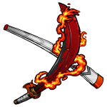 Flame Katana — **5%** 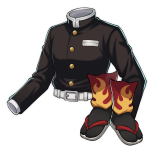 Flame Slayer Uniform — **5%** 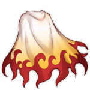 Flame Haori Style 2 — **3%** |
|  | **Saneri** The Wind Hashira | 3000 | 300s | 1000 / 450 |  [World Events Chest](#world-events-chest) |  Idaten Typhoon — **10%** (skill · pity 35) 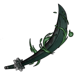 Wind Katana — **5%** 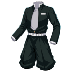 Wind Slayer Uniform — **5%**  Wind Haori — **3%** |
| 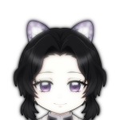 | **Shinora** The Insect Hashira | 3000 | 300s | 1000 / 450 |  [World Events Chest](#world-events-chest) |  Illusory Light — **10%** (skill · pity 35) 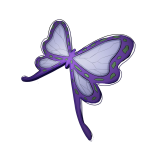 Butterfly Hair Clip — **5%** 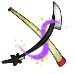 Insect Katana — **5%** 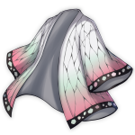 Insect Haori — **3%** |
| 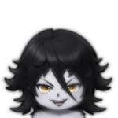 | **Sumari** The Temari Demon 🌙 night only | 3000 | 300s | 1000 / 450 |  [World Events Chest](#world-events-chest) |  Spiraling Shot — **10%** (skill · pity 35) 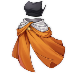 Sumari's Outfit — **5%** |
| 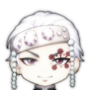 | **Tengai** The Sound Hashira | 3000 | 300s | 1000 / 450 |  [World Events Chest](#world-events-chest) |  String Performance — **10%** (skill · pity 35) 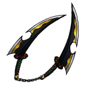 Sound Katanas — **5%** 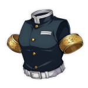 Sound Slayer Uniform — **5%** |
| 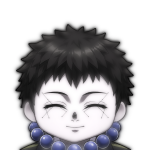 | **Yahari** The Arrow Demon 🌙 night only | 3000 | 300s | 1000 / 450 |  [World Events Chest](#world-events-chest) |  Koketsu Arrow — **10%** (skill · pity 35) 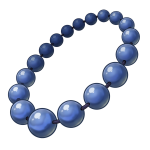 Yahari Necklace — **5%** |
| 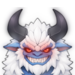 | **Yeti Demon** Ancient Frost Demon | 2790 | 120s | 2025 / 600 |  [World Events Chest](#world-events-chest) 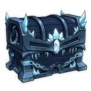 [Ice Chest](#ice-chest) 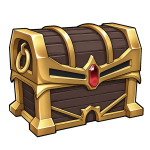 [Rare Chest](#rare-chest) | 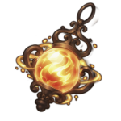 Emberheart Lantern — **25%** (skill · pity 10) |
| 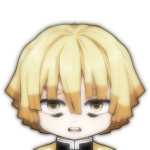 | **Zentaro** The Thunder King | 3000 | 300s | 1000 / 450 |  [World Events Chest](#world-events-chest) |  Flaming Thunder God — **10%** (skill · pity 35) 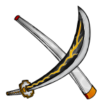 Thunder Katana — **5%** 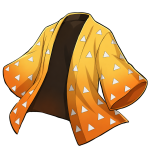 Thunder Haori — **3%** |

### Bosses

| | Boss | HP | Respawn | Exp / Wen | Chest | Drops |
|:-:|---|--:|--:|--:|---|---|
|  | **Duelist Hibiki** The Last Owner | 3000 | 1s | 500 / 250 | — | — |
|  | **Fujiko** The Bladed Wagasa 📍 Final Selection Plains | 3200 | 180s | 700 / 315 |  [Ice Chest](#ice-chest) |  Shade Breaker — **10%** (skill · pity 35)  Bladed Wagasa — **5%** (Lv 150)  Fujiko’s Outfit — **1.8%** (Lv 150) |
|  | **Hand Demon** Boss 📍 Final Selection | 1310 | 120s | — / 25 | — | — |
|  | **Hoyuzo** The Sickle Reaper 📍 Bamboo Grove | 1445 | 180s | 360 / 160 |  [Rare Chest](#rare-chest) |  Scyther Vortex — **15%** (skill · pity 35)  Demon Horns — **50%** (×3)  Sickles — **15%** (Lv 52)  Hiyozu's Bottom — **3%** (Lv 52)  Hiyozu's Top — **3%** (Lv 52) |
|  | **Kaiden** The Claw Ravager 📍 Bamboo Grove | 825 | 165s | 250 / 113 |  [Common Chest](#common-chest) |  Predator Claws — **15%** (skill · pity 35)  Kaiden's Bottom — **15%** (Lv 30)  Kaiden's Top — **15%** (Lv 30)  Claws — **7%** (Lv 30) |
|  | **Lost** The Lost Slayer 📍 Final Selection | 790 | 45s | — / 10 |  [Lost Chest](#lost-chest) |  Shotgun Schematic — **5%** |
|  | **Mother Bear** Boss 📍 Bamboo Grove | 525 | 110s | 180 / 80 |  [Common Chest](#common-chest) | — |

### Mini bosses

| | Boss | HP | Respawn | Exp / Wen | Chest | Drops |
|:-:|---|--:|--:|--:|---|---|
|  | **Flame Trainee** Mini Boss | 600 | 120s | 185 / 83 |  [Common Chest](#common-chest) | — |
|  | **Insect Trainee** Mini Boss | 600 | 120s | 185 / 83 |  [Common Chest](#common-chest) | — |
|  | **Reaper Trainee Kuzan** Mini Boss | 1530 | 120s | 230 / 104 |  [Ice Chest](#ice-chest) |  Traversal Reap — **10%** (skill · pity 35) |
|  | **Serpent Trainee** Mini Boss | 600 | 120s | 185 / 83 |  [Common Chest](#common-chest) | — |
|  | **Soryu Trainee Goki** Mini Boss | 1050 | 120s | 220 / 99 |  [Rare Chest](#rare-chest) |  Face Breaker — **10%** (skill · pity 35) |
|  | **Sound Trainee** Mini Boss | 600 | 120s | 185 / 83 |  [Common Chest](#common-chest) | — |
|  | **Stone Trainee** Mini Boss | 600 | 120s | 185 / 83 |  [Common Chest](#common-chest) |  Axe and Mace — **15%** |
|  | **Tai Chi Trainee Suzume** Mini Boss | 1050 | 120s | 220 / 99 |  [Rare Chest](#rare-chest) |  Twin Harmony — **10%** (skill · pity 35) |
|  | **Thunder Trainee** Mini Boss | 600 | 120s | 185 / 83 |  [Common Chest](#common-chest) | — |
|  | **Water Trainee Sabito** Mini Boss | 600 | 120s | 185 / 83 |  [Common Chest](#common-chest) |  Ghost Attendant Outfit — **2%**  Scarred Warding Mask — **2%** |
|  | **Wind Trainee** Mini Boss | 600 | 120s | 185 / 83 |  [Common Chest](#common-chest) | — |
|  | **Zuko** Mini Boss 📍 Windy Peak | 300 | 90s | 60 / 25 |  [Common Chest](#common-chest) |  Quick Draw — **30%** (skill · pity 35)  Cutlass — **20%** (Lv 10) |

## Mob drops

Regular mobs that drop items. Every other mob drops only Exp and Wen.

| Mob | Region | Drop | Chance | Qty |
|---|---|---|--:|--:|
| Beast Born Demon 🌙 | Mistfall Harbor |  Beast Core | 50% | 1 |
| Blood Hounded Demon | Mistfall Harbor |  Demon Horns | 50% | 1 |
| Greater Demon | Butterfly Estate |  Demon Horns | 50% | 2 |
| High Demon | Iceveil Valley |  Demon Horns | 50% | 2 |
| Hoyuzo Subordinate | Bamboo Grove |  Demon Horns | 50% | 1 |
| Lesser Demon | Butterfly Estate |  Demon Horns | 50% | 1 |
| Mizunoto | Mistfall Harbor |  Broken Nichirin Katana | 50% | 1 |

## Chests

[World Events Chest](#world-events-chest) · [Common Chest](#common-chest) · [Rare Chest](#rare-chest) · [Ice Chest](#ice-chest) · [Lost Chest](#lost-chest) · [Sealed Cache T1](#sealed-cache-t1) · [Sealed Cache T2](#sealed-cache-t2) · [Sealed Cache T3](#sealed-cache-t3) · [Snow Chest](#snow-chest) · [Ouwigahara Chest](#ouwigahara-chest) · [Ouwigahara Cache](#ouwigahara-cache) · [Ouwigahara Deep Cache](#ouwigahara-deep-cache)

### World Events Chest

 Dropped by Akazo, Datai, Domae, Enru, Giyen, Gyorei, Gyutai, Nezura, Obari, Reaper, Rengu, Saneri, Shinora, Sumari, Tengai, Yahari, Yeti Demon, Zentaro.

| | Item | Rarity | Chance | Qty | Notes |
|:-:|---|---|--:|--:|---|
|  | **Coin Pouch** | 🟪 Epic | **guaranteed** | 2–3 |  |
|  | **Refinement Ore** | 🟦 Rare | **guaranteed** | 4–7 |  |
|  | **Silk Thread** | ⬜ Common | **guaranteed** | 3–5 |  |
|  | **Metal Scraps** | ⬜ Common | **guaranteed** | 3–5 |  |
|  | Metal Scraps | ⬜ Common | 50% | 1 |  |
|  | Silk Thread | ⬜ Common | 50% | 1 |  |
|  | Refinement Ore | 🟦 Rare | 20% | 1 |  |
|  | Ore | 🟥 Mythic | 5% | 1 | unboosted |
|  | Stylish Haori | 🟨 Legendary | 5% | 1 |  |
|  | Mythic Refinement Ore | 🟥 Mythic | 4% | 1 |  |
|  | Black Dragon Armour | 🟥 Mythic | 3% | 1 |  |
|  | Black Kumo Slayers Uniform | 🟥 Mythic | 3% | 1 |  |
|  | Demonic Lantern | 🟥 Mythic | 3% | 1 |  |
|  | Flame Haori Style 1 | 🟥 Mythic | 3% | 1 |  |
|  | Flame Scarf | 🟥 Mythic | 3% | 1 |  |
|  | Kintsugi  Haori | 🟥 Mythic | 3% | 1 |  |
|  | Arrow Orb |  | 2% | 1 |  |
|  | Blood Manipulation Orb |  | 2% | 1 |  |
|  | Cryokinesis Orb |  | 2% | 1 |  |
|  | Dream Orb |  | 2% | 1 |  |
|  | Firstlight Forged Ingot | 🟥 Mythic | 2% | 1 |  |
|  | Firstlight Star Ore | 🟥 Mythic | 2% | 1 |  |
|  | Firstlight Weaver's Silk | 🟥 Mythic | 2% | 1 |  |
|  | Nightfall Forged Ingot | 🟥 Mythic | 2% | 1 |  |
|  | Nightfall Reinforced Plating | 🟥 Mythic | 2% | 1 |  |
|  | Nightfall Weaver's Cloth | 🟥 Mythic | 2% | 1 |  |
|  | Obi Manipulation Orb |  | 2% | 1 |  |
|  | Pyrokenesis Orb |  | 2% | 1 |  |
|  | Reaper Orb |  | 2% | 1 |  |
|  | Refinement Guard | ⬛ Impossible | 2% | 1 |  |
|  | Shockwave Orb |  | 2% | 1 |  |
|  | Tamari Orb |  | 2% | 1 |  |

### Common Chest

 Dropped by Flame Trainee, Insect Trainee, Kaiden, Mother Bear, Serpent Trainee, Sound Trainee, Stone Trainee, Thunder Trainee, Water Trainee Sabito, Wind Trainee, Zuko.

| | Item | Rarity | Chance | Qty | Notes |
|:-:|---|---|--:|--:|---|
|  | Shima Koshimaki | ⬜ Common | 12% | 1 |  |
|  | Black Kumo Haori | 🟦 Rare | 6% | 1 |  |
|  | Chained Glasses | 🟦 Rare | 6% | 1 |  |
|  | Healing Gem Necklace | ⬜ Common | 6% | 1 |  |
|  | Hoshiko Kesa | 🟦 Rare | 6% | 1 |  |
|  | Kasumi Yukata | 🟦 Rare | 6% | 1 |  |
|  | Mask of Memories | 🟦 Rare | 6% | 1 |  |
|  | Masquerade Mask | 🟦 Rare | 6% | 1 |  |
|  | Mist Kumo Sodenashi | 🟦 Rare | 6% | 1 |  |
|  | Monster Paper Bag | 🟦 Rare | 6% | 1 |  |
|  | Mouth Dagger | 🟦 Rare | 6% | 1 |  |
|  | One-Horned Imp Mask | 🟦 Rare | 6% | 1 |  |
|  | Sweet Dreams Eye Mask | 🟦 Rare | 6% | 1 |  |
|  | Uzumaki Yukata | 🟦 Rare | 6% | 1 |  |
|  | Whispering Winds Earrings | ⬜ Common | 6% | 1 |  |
|  | Crimson Necklace | 🟦 Rare | 3% | 1 |  |
|  | Floral Warding Mask | 🟦 Rare | 3% | 1 |  |
|  | Prayer of wind Necklace | 🟦 Rare | 3% | 1 |  |
|  | Ore | 🟥 Mythic | 2.5% | 1 | unboosted |
|  | Gleam Headband | 🟪 Epic | 2% | 1 |  |
|  | Monster Hood | 🟪 Epic | 2% | 1 |  |
|  | Fujiko's Lantern | 🟨 Legendary | 1.5% | 1 |  |
|  | Lycoris Haori | 🟨 Legendary | 1.5% | 1 |  |
|  | Arrow Orb |  | 1% | 1 |  |
|  | Blood Manipulation Orb |  | 1% | 1 |  |
|  | Cryokinesis Orb |  | 1% | 1 |  |
|  | Dream Orb |  | 1% | 1 |  |
|  | Obi Manipulation Orb |  | 1% | 1 |  |
|  | Pyrokenesis Orb |  | 1% | 1 |  |
|  | Reaper Orb |  | 1% | 1 |  |
|  | Shockwave Orb |  | 1% | 1 |  |
|  | Tamari Orb |  | 1% | 1 |  |

### Rare Chest

 Dropped by Hoyuzo, Soryu Trainee Goki, Tai Chi Trainee Suzume, Yeti Demon.

| | Item | Rarity | Chance | Qty | Notes |
|:-:|---|---|--:|--:|---|
|  | Bandaged Mask | ⬜ Common | 12% | 1 |  |
|  | Blindfolds | ⬜ Common | 12% | 1 |  |
|  | Clear Wind Hakama | ⬜ Common | 12% | 1 |  |
|  | Runic Eye Mask | ⬜ Common | 12% | 1 |  |
|  | Star Eye Patch | ⬜ Common | 12% | 1 |  |
|  | Frozen Heart | 🟪 Epic | 10% | 1 | unboosted |
|  | Healing Gem Necklace | ⬜ Common | 9% | 1 |  |
|  | Whispering Winds Earrings | ⬜ Common | 9% | 1 |  |
|  | Spear | 🟪 Epic | 7% | 1 |  |
|  | Deku Haori | 🟦 Rare | 6% | 1 |  |
|  | Himawari Kesa | 🟦 Rare | 6% | 1 |  |
|  | Mocking Mask | 🟦 Rare | 6% | 1 |  |
|  | Stylish Mask | 🟦 Rare | 6% | 1 |  |
|  | Ore | 🟥 Mythic | 5% | 1 | unboosted |
|  | Crimson Necklace | 🟦 Rare | 4.5% | 1 |  |
|  | Floral Warding Mask | 🟦 Rare | 4.5% | 1 |  |
|  | Prayer of wind Necklace | 🟦 Rare | 4.5% | 1 |  |
|  | Battle Kimono Uniform | 🟨 Legendary | 3% | 1 |  |
|  | Arrow Orb |  | 2% | 1 |  |
|  | Blood Manipulation Orb |  | 2% | 1 |  |
|  | Cryokinesis Orb |  | 2% | 1 |  |
|  | Dream Orb |  | 2% | 1 |  |
|  | Ice Necklace | 🟪 Epic | 2% | 1 |  |
|  | Kuzushiji Kata-Aki | 🟪 Epic | 2% | 1 |  |
|  | Mandala Kata-Aki | 🟪 Epic | 2% | 1 |  |
|  | Obi Manipulation Orb |  | 2% | 1 |  |
|  | Plume Haori | 🟪 Epic | 2% | 1 |  |
|  | Pyrokenesis Orb |  | 2% | 1 |  |
|  | Reaper Orb |  | 2% | 1 |  |
|  | Shockwave Orb |  | 2% | 1 |  |
|  | Silent Vesture Top Hat | 🟪 Epic | 2% | 1 |  |
|  | Tamari Orb |  | 2% | 1 |  |
|  | White Hooded Haori | 🟪 Epic | 2% | 1 |  |

### Ice Chest

 Dropped by Fujiko, Reaper Trainee Kuzan, Yeti Demon.

| | Item | Rarity | Chance | Qty | Notes |
|:-:|---|---|--:|--:|---|
|  | Healing Gem Necklace | ⬜ Common | 12% | 1 |  |
|  | Monocle | ⬜ Common | 12% | 1 |  |
|  | Monster Ears | ⬜ Common | 12% | 1 |  |
|  | Whispering Winds Earrings | ⬜ Common | 12% | 1 |  |
|  | Crimson Necklace | 🟦 Rare | 6% | 1 |  |
|  | Crimson Wrap Hakama | 🟦 Rare | 6% | 1 |  |
|  | Damask Kata-Aki | 🟦 Rare | 6% | 1 |  |
|  | Floral Warding Mask | 🟦 Rare | 6% | 1 |  |
|  | Hem stripe Kata-Aki | 🟦 Rare | 6% | 1 |  |
|  | Lantern of Despair | 🟦 Rare | 6% | 1 |  |
|  | Prayer of wind Necklace | 🟦 Rare | 6% | 1 |  |
|  | Seiun Kesa | 🟦 Rare | 6% | 1 |  |
|  | Summer Night Mask | 🟦 Rare | 6% | 1 |  |
|  | Ore | 🟥 Mythic | 5% | 1 | unboosted |
|  | Wondering Obi Belt | 🟨 Legendary | 3% | 1 |  |
|  | Abyssal Lantern | 🟪 Epic | 2% | 1 |  |
|  | Arrow Orb |  | 2% | 1 |  |
|  | Blood Manipulation Orb |  | 2% | 1 |  |
|  | Crescent Marked Veil | 🟪 Epic | 2% | 1 |  |
|  | Cryokinesis Orb |  | 2% | 1 |  |
|  | Demonic Horns | 🟪 Epic | 2% | 1 |  |
|  | Dream Orb |  | 2% | 1 |  |
|  | Midnight Blossom Cloak | 🟪 Epic | 2% | 1 |  |
|  | Moonlit Kata-Aki | 🟪 Epic | 2% | 1 |  |
|  | Obi Manipulation Orb |  | 2% | 1 |  |
|  | Pyrokenesis Orb |  | 2% | 1 |  |
|  | Reaper Orb |  | 2% | 1 |  |
|  | Shockwave Orb |  | 2% | 1 |  |
|  | Tamari Orb |  | 2% | 1 |  |
|  | Two-Horned Mask | 🟪 Epic | 2% | 1 |  |

### Lost Chest

 Dropped by Lost.

| | Item | Rarity | Chance | Qty | Notes |
|:-:|---|---|--:|--:|---|
|  | **Metal Scraps** | ⬜ Common | **guaranteed** | 1 |  |
|  | Metal Scraps | ⬜ Common | 7.5% | 1 |  |
|  | Silk Thread | ⬜ Common | 7.5% | 1 |  |
|  | Monster Ears | ⬜ Common | 3.6% | 1 |  |
|  | Refinement Ore | 🟦 Rare | 3% | 1 |  |
|  | Ore | 🟥 Mythic | 2.5% | 1 | unboosted |
|  | Squid Beanie | 🟦 Rare | 1.8% | 1 |  |
|  | Envoy of Night Mask | 🟨 Legendary | 1.5% | 1 |  |
|  | Arrow Orb |  | 1% | 1 |  |
|  | Blood Manipulation Orb |  | 1% | 1 |  |
|  | Cryokinesis Orb |  | 1% | 1 |  |
|  | Dream Orb |  | 1% | 1 |  |
|  | Obi Manipulation Orb |  | 1% | 1 |  |
|  | Pyrokenesis Orb |  | 1% | 1 |  |
|  | Reaper Orb |  | 1% | 1 |  |
|  | Shockwave Orb |  | 1% | 1 |  |
|  | Tamari Orb |  | 1% | 1 |  |
|  | Lost Cape | 🟥 Mythic | 0.9% | 1 |  |
|  | Lost Lantern | 🟥 Mythic | 0.9% | 1 |  |
|  | Lost Mask | 🟥 Mythic | 0.9% | 1 |  |
|  | Lost Outfit | 🟥 Mythic | 0.9% | 1 |  |
|  | Mythic Refinement Ore | 🟥 Mythic | 0.6% | 1 |  |
|  | Refinement Guard | ⬛ Impossible | 0.3% | 1 |  |

### Sealed Cache T1

 Sealed Chest world event, guarded by Grove Raiders and a Raid Captain. Exp: share 0.1, level 25.

| | Item | Rarity | Chance | Qty | Notes |
|:-:|---|---|--:|--:|---|
|  | **Coin** | ⬜ Common | **guaranteed** | 2–4 |  |
|  | **Silk Thread** | ⬜ Common | **guaranteed** | 1–3 |  |
|  | **Metal Scraps** | ⬜ Common | **guaranteed** | 1–3 |  |
|  | Coin Stack | 🟩 Uncommon | 45% | 1–2 |  |
|  | Health Regen Potion | ⬜ Common | 25% | 1 |  |
|  | Stamina Regen Potion | ⬜ Common | 20% | 1 |  |
|  | Metal Scraps | ⬜ Common | 12.5% | 1 |  |
|  | Silk Thread | ⬜ Common | 12.5% | 1 |  |
|  | Frozen Heart | 🟪 Epic | 10% | 1 | unboosted |
|  | Bamboo Sandogasa | 🟨 Legendary | 5% | 1 |  |
|  | Coin Pile | 🟦 Rare | 5% | 1 |  |
|  | Ore | 🟥 Mythic | 5% | 1 | unboosted |
|  | Refinement Ore | 🟦 Rare | 5% | 1 |  |
|  | Golden Tentacle | 🟨 Legendary | 3% | 1 |  |
|  | Arrow Orb |  | 2% | 1 |  |
|  | Blood Manipulation Orb |  | 2% | 1 |  |
|  | Cryokinesis Orb |  | 2% | 1 |  |
|  | Dream Orb |  | 2% | 1 |  |
|  | Obi Manipulation Orb |  | 2% | 1 |  |
|  | Pyrokenesis Orb |  | 2% | 1 |  |
|  | Reaper Orb |  | 2% | 1 |  |
|  | Shockwave Orb |  | 2% | 1 |  |
|  | Tamari Orb |  | 2% | 1 |  |
|  | Scythe | 🟨 Legendary | 1.75% | 1 |  |
|  | Tanto | 🟨 Legendary | 1.25% | 1 |  |
|  | Mythic Refinement Ore | 🟥 Mythic | 1% | 1 |  |
|  | Refinement Guard | ⬛ Impossible | 0.5% | 1 |  |

### Sealed Cache T2

 Sealed Chest world event, guarded by Cache Lancers and a Lancer Captain. Exp: share 0.1, level 65.

| | Item | Rarity | Chance | Qty | Notes |
|:-:|---|---|--:|--:|---|
|  | **Coin Stack** | 🟩 Uncommon | **guaranteed** | 4–6 |  |
|  | **Silk Thread** | ⬜ Common | **guaranteed** | 2–4 |  |
|  | **Metal Scraps** | ⬜ Common | **guaranteed** | 2–4 |  |
|  | Coin Pile | 🟦 Rare | 50% | 1 |  |
|  | Health Regen Elixir | 🟩 Uncommon | 25% | 1 |  |
|  | Metal Scraps | ⬜ Common | 25% | 1 |  |
|  | Silk Thread | ⬜ Common | 25% | 1 |  |
|  | Stamina Regen Elixir | 🟩 Uncommon | 20% | 1 |  |
|  | Frozen Heart | 🟪 Epic | 10% | 1 | unboosted |
|  | Refinement Ore | 🟦 Rare | 10% | 1 |  |
|  | Golden Tentacle | 🟨 Legendary | 8% | 1–2 |  |
|  | Ore | 🟥 Mythic | 5% | 1 | unboosted |
|  | Overdrive Earrings | 🟨 Legendary | 5% | 1 |  |
|  | Scythe | 🟨 Legendary | 3.5% | 1 |  |
|  | Tanto | 🟨 Legendary | 2.5% | 1 |  |
|  | Arrow Orb |  | 2% | 1 |  |
|  | Blood Manipulation Orb |  | 2% | 1 |  |
|  | Cryokinesis Orb |  | 2% | 1 |  |
|  | Dream Orb |  | 2% | 1 |  |
|  | Mythic Refinement Ore | 🟥 Mythic | 2% | 1 |  |
|  | Obi Manipulation Orb |  | 2% | 1 |  |
|  | Pyrokenesis Orb |  | 2% | 1 |  |
|  | Reaper Orb |  | 2% | 1 |  |
|  | Shockwave Orb |  | 2% | 1 |  |
|  | Tamari Orb |  | 2% | 1 |  |
|  | Refinement Guard | ⬛ Impossible | 1% | 1 |  |

### Sealed Cache T3

 Sealed Chest world event, guarded by Cache Prowlers and a Prowler Captain. Exp: share 0.1, level 150.

| | Item | Rarity | Chance | Qty | Notes |
|:-:|---|---|--:|--:|---|
|  | **Coin Stack** | 🟩 Uncommon | **guaranteed** | 4–7 |  |
|  | **Refinement Ore** | 🟦 Rare | **guaranteed** | 4–7 |  |
|  | **Silk Thread** | ⬜ Common | **guaranteed** | 3–5 |  |
|  | **Metal Scraps** | ⬜ Common | **guaranteed** | 3–5 |  |
|  | Coin Pile | 🟦 Rare | 60% | 1 |  |
|  | Metal Scraps | ⬜ Common | 50% | 1 |  |
|  | Silk Thread | ⬜ Common | 50% | 1 |  |
|  | Health Regen Elixir | 🟩 Uncommon | 25% | 1–2 |  |
|  | Coin Pouch | 🟪 Epic | 20% | 1 |  |
|  | Refinement Ore | 🟦 Rare | 20% | 1 |  |
|  | Stamina Regen Elixir | 🟩 Uncommon | 20% | 1–2 |  |
|  | Golden Tentacle | 🟨 Legendary | 12% | 2–4 |  |
|  | Frozen Heart | 🟪 Epic | 10% | 1 | unboosted |
|  | Scythe | 🟨 Legendary | 7% | 1 |  |
|  | Ore | 🟥 Mythic | 5% | 1 | unboosted |
|  | Tanto | 🟨 Legendary | 5% | 1 |  |
|  | Mythic Refinement Ore | 🟥 Mythic | 4% | 1 |  |
|  | Classic Straw Hat | 🟥 Mythic | 3% | 1 |  |
|  | Arrow Orb |  | 2% | 1 |  |
|  | Blood Manipulation Orb |  | 2% | 1 |  |
|  | Cryokinesis Orb |  | 2% | 1 |  |
|  | Dream Orb |  | 2% | 1 |  |
|  | Obi Manipulation Orb |  | 2% | 1 |  |
|  | Pyrokenesis Orb |  | 2% | 1 |  |
|  | Reaper Orb |  | 2% | 1 |  |
|  | Refinement Guard | ⬛ Impossible | 2% | 1 |  |
|  | Shockwave Orb |  | 2% | 1 |  |
|  | Tamari Orb |  | 2% | 1 |  |

### Snow Chest

 Iceveil Valley snow chest (config `snow-chest-v2`). Where it spawns is decided on the server (not verified). Exp: share 0.03, level 110.

| | Item | Rarity | Chance | Qty | Notes |
|:-:|---|---|--:|--:|---|
|  | **Coin Stack** | 🟩 Uncommon | **guaranteed** | 1–3 |  |
|  | **Refinement Ore** | 🟦 Rare | **guaranteed** | 2–3 |  |
|  | **Silk Thread** | ⬜ Common | **guaranteed** | 1–2 |  |
|  | **Metal Scraps** | ⬜ Common | **guaranteed** | 1–2 |  |
|  | Coin Pile | 🟦 Rare | 40% | 1 |  |
|  | Metal Scraps | ⬜ Common | 17.5% | 1 |  |
|  | Silk Thread | ⬜ Common | 17.5% | 1 |  |
|  | Health Regen Elixir | 🟩 Uncommon | 12% | 1 |  |
|  | Stamina Regen Elixir | 🟩 Uncommon | 10% | 1 |  |
|  | Coin Pouch | 🟪 Epic | 7% | 1 |  |
|  | Refinement Ore | 🟦 Rare | 7% | 1 |  |
|  | Ore | 🟥 Mythic | 2% | 1 | unboosted |
|  | Mythic Refinement Ore | 🟥 Mythic | 1.4% | 1 |  |
|  | Refinement Guard | ⬛ Impossible | 0.7% | 1 |  |
|  | Arrow Orb |  | 0.667% | 1 |  |
|  | Blood Manipulation Orb |  | 0.667% | 1 |  |
|  | Cryokinesis Orb |  | 0.667% | 1 |  |
|  | Dream Orb |  | 0.667% | 1 |  |
|  | Obi Manipulation Orb |  | 0.667% | 1 |  |
|  | Pyrokenesis Orb |  | 0.667% | 1 |  |
|  | Reaper Orb |  | 0.667% | 1 |  |
|  | Shockwave Orb |  | 0.667% | 1 |  |
|  | Tamari Orb |  | 0.667% | 1 |  |

### Ouwigahara Chest

 Ouwigahara dungeon. Opening it costs `OuwigaharaPoints` (probably the end-of-run chest; inferred).

| | Item | Rarity | Chance | Qty | Notes |
|:-:|---|---|--:|--:|---|
|  | **Coin Pouch** | 🟪 Epic | **guaranteed** | 1 |  |
|  | **Silk Thread** | ⬜ Common | **guaranteed** | 10–20 |  |
|  | **Metal Scraps** | ⬜ Common | **guaranteed** | 10–20 |  |
|  | **Stamina Regen Potion** | ⬜ Common | **guaranteed** | 1 |  |
|  | **Health Regen Potion** | ⬜ Common | **guaranteed** | 1 |  |
|  | **Refinement Ore** | 🟦 Rare | **guaranteed** | 15–25 |  |
|  | Black Monster Ears | 🟩 Uncommon | 12% | 1 |  |
|  | Eye Sash | 🟩 Uncommon | 12% | 1 |  |
|  | Mimic Necklace | 🟩 Uncommon | 12% | 1 |  |
|  | Azure Necklace | 🟪 Epic | 6% | 1 |  |
|  | Flame Veil | 🟪 Epic | 6% | 1 |  |
|  | Haki Haori | 🟪 Epic | 6% | 1 |  |
|  | Sargent’s Kesa | 🟪 Epic | 6% | 1 |  |
|  | Bokashi-Zome Kata-Aki | 🟨 Legendary | 5% | 1 |  |
|  | Demonic Horns II | 🟨 Legendary | 5% | 1 |  |
|  | Firstlight Forged Ingot | 🟥 Mythic | 5% | 1 |  |
|  | Firstlight Star Ore | 🟥 Mythic | 5% | 1 |  |
|  | Firstlight Weaver's Silk | 🟥 Mythic | 5% | 1 |  |
|  | Nichirin Lantern | 🟨 Legendary | 5% | 1 |  |
|  | Nightfall Forged Ingot | 🟥 Mythic | 5% | 1 |  |
|  | Nightfall Reinforced Plating | 🟥 Mythic | 5% | 1 |  |
|  | Nightfall Weaver's Cloth | 🟥 Mythic | 5% | 1 |  |
|  | Ore | 🟥 Mythic | 5% | 1 | unboosted |
|  | Red Oni Mask | 🟨 Legendary | 5% | 1 |  |
|  | Silver Fang Mask | 🟨 Legendary | 5% | 1 |  |
|  | Straw Fringe Hat | 🟨 Legendary | 5% | 1 |  |
|  | Todoroki Koshimaki | 🟨 Legendary | 5% | 1 |  |
|  | Yang Fur Kesa | 🟨 Legendary | 5% | 1 |  |
|  | Azure Drape Scarf | 🟥 Mythic | 3% | 1 |  |
|  | Flame Amigasa | 🟥 Mythic | 3% | 1 |  |
|  | Fractured Web Kata-Aki | 🟥 Mythic | 3% | 1 |  |

### Ouwigahara Cache

 Ouwigahara dungeon cache. Where it spawns is decided on the server (not verified).

| | Item | Rarity | Chance | Qty | Notes |
|:-:|---|---|--:|--:|---|
|  | **Coin Pouch** | 🟪 Epic | **guaranteed** | 1–3 | split between openers (inferred) |
|  | **Coin** | ⬜ Common | **guaranteed** | 4–6 | split between openers (inferred) |
|  | Black Monster Ears | 🟩 Uncommon | 12% | 1 |  |
|  | Eye Sash | 🟩 Uncommon | 12% | 1 |  |
|  | Mimic Necklace | 🟩 Uncommon | 12% | 1 |  |
|  | Azure Necklace | 🟪 Epic | 6% | 1 |  |
|  | Flame Veil | 🟪 Epic | 6% | 1 |  |
|  | Haki Haori | 🟪 Epic | 6% | 1 |  |
|  | Sargent’s Kesa | 🟪 Epic | 6% | 1 |  |
|  | Bokashi-Zome Kata-Aki | 🟨 Legendary | 5% | 1 |  |
|  | Demonic Horns II | 🟨 Legendary | 5% | 1 |  |
|  | Firstlight Forged Ingot | 🟥 Mythic | 5% | 1 |  |
|  | Firstlight Star Ore | 🟥 Mythic | 5% | 1 |  |
|  | Firstlight Weaver's Silk | 🟥 Mythic | 5% | 1 |  |
|  | Nichirin Lantern | 🟨 Legendary | 5% | 1 |  |
|  | Nightfall Forged Ingot | 🟥 Mythic | 5% | 1 |  |
|  | Nightfall Reinforced Plating | 🟥 Mythic | 5% | 1 |  |
|  | Nightfall Weaver's Cloth | 🟥 Mythic | 5% | 1 |  |
|  | Ore | 🟥 Mythic | 5% | 1 | unboosted |
|  | Red Oni Mask | 🟨 Legendary | 5% | 1 |  |
|  | Silver Fang Mask | 🟨 Legendary | 5% | 1 |  |
|  | Straw Fringe Hat | 🟨 Legendary | 5% | 1 |  |
|  | Todoroki Koshimaki | 🟨 Legendary | 5% | 1 |  |
|  | Yang Fur Kesa | 🟨 Legendary | 5% | 1 |  |
|  | Azure Drape Scarf | 🟥 Mythic | 3% | 1 |  |
|  | Flame Amigasa | 🟥 Mythic | 3% | 1 |  |
|  | Fractured Web Kata-Aki | 🟥 Mythic | 3% | 1 |  |

### Ouwigahara Deep Cache

 Ouwigahara dungeon, deeper cache: double the odds of the regular Cache. Where it spawns is not verified.

| | Item | Rarity | Chance | Qty | Notes |
|:-:|---|---|--:|--:|---|
|  | **Coin Pouch** | 🟪 Epic | **guaranteed** | 2–4 | split between openers (inferred) |
|  | **Coin** | ⬜ Common | **guaranteed** | 6–8 | split between openers (inferred) |
|  | **Coin Stack** | 🟩 Uncommon | **guaranteed** | 2–3 | split between openers (inferred) |
|  | Black Monster Ears | 🟩 Uncommon | 24% | 1 |  |
|  | Eye Sash | 🟩 Uncommon | 24% | 1 |  |
|  | Mimic Necklace | 🟩 Uncommon | 24% | 1 |  |
|  | Azure Necklace | 🟪 Epic | 12% | 1 |  |
|  | Flame Veil | 🟪 Epic | 12% | 1 |  |
|  | Haki Haori | 🟪 Epic | 12% | 1 |  |
|  | Sargent’s Kesa | 🟪 Epic | 12% | 1 |  |
|  | Bokashi-Zome Kata-Aki | 🟨 Legendary | 10% | 1 |  |
|  | Demonic Horns II | 🟨 Legendary | 10% | 1 |  |
|  | Nichirin Lantern | 🟨 Legendary | 10% | 1 |  |
|  | Red Oni Mask | 🟨 Legendary | 10% | 1 |  |
|  | Silver Fang Mask | 🟨 Legendary | 10% | 1 |  |
|  | Straw Fringe Hat | 🟨 Legendary | 10% | 1 |  |
|  | Todoroki Koshimaki | 🟨 Legendary | 10% | 1 |  |
|  | Yang Fur Kesa | 🟨 Legendary | 10% | 1 |  |
|  | Azure Drape Scarf | 🟥 Mythic | 6% | 1 |  |
|  | Flame Amigasa | 🟥 Mythic | 6% | 1 |  |
|  | Fractured Web Kata-Aki | 🟥 Mythic | 6% | 1 |  |
|  | Firstlight Forged Ingot | 🟥 Mythic | 5% | 1 |  |
|  | Firstlight Star Ore | 🟥 Mythic | 5% | 1 |  |
|  | Firstlight Weaver's Silk | 🟥 Mythic | 5% | 1 |  |
|  | Nightfall Forged Ingot | 🟥 Mythic | 5% | 1 |  |
|  | Nightfall Reinforced Plating | 🟥 Mythic | 5% | 1 |  |
|  | Nightfall Weaver's Cloth | 🟥 Mythic | 5% | 1 |  |
|  | Ore | 🟥 Mythic | 5% | 1 | unboosted |

## Where to get an item

Every drop above, A–Z, with every place it drops from (best chance first).

| | Item | Rarity | Sources |
|:-:|---|---|---|
|  | Abyssal Lantern | 🟪 Epic | Ice Chest (2%) |
|  | Akazo's Bottom | 🟨 Legendary | Akazo (5%) |
|  | Akazo's Top | 🟨 Legendary | Akazo (5%) |
|  | Annihilation Type |  | Akazo (10%) |
|  | Arcs of Justice |  | Gyorei (10%) |
|  | Arrow Orb |  | Sealed Cache T2 (2%), World Events Chest (2%), Sealed Cache T3 (2%), Rare Chest (2%), Ice Chest (2%), Sealed Cache T1 (2%), Lost Chest (1%), Common Chest (1%), Snow Chest (0.667%) |
|  | Axe and Mace | 🟨 Legendary | Stone Trainee (15%) |
|  | Azure Drape Scarf | 🟥 Mythic | Ouwigahara Deep Cache (6%), Ouwigahara Chest (3%), Ouwigahara Cache (3%) |
|  | Azure Necklace | 🟪 Epic | Ouwigahara Deep Cache (12%), Ouwigahara Chest (6%), Ouwigahara Cache (6%) |
|  | Bamboo Muzzle | 🟥 Mythic | Nezura (3%) |
|  | Bamboo Sandogasa | 🟨 Legendary | Sealed Cache T1 (5%) |
|  | Bandaged Mask | ⬜ Common | Rare Chest (12%) |
|  | Battle Kimono Uniform | 🟨 Legendary | Rare Chest (3%) |
|  | Beast Core | 🟩 Uncommon | Beast Born Demon (50%) |
|  | Black Dragon Armour | 🟥 Mythic | World Events Chest (3%) |
|  | Black Kumo Haori | 🟦 Rare | Common Chest (6%) |
|  | Black Kumo Slayers Uniform | 🟥 Mythic | World Events Chest (3%) |
|  | Black Lotus Crown | 🟨 Legendary | Domae (5%) |
|  | Black Monster Ears | 🟩 Uncommon | Ouwigahara Deep Cache (24%), Ouwigahara Chest (12%), Ouwigahara Cache (12%) |
|  | Bladed Wagasa | 🟨 Legendary | Fujiko (5%) |
|  | Blindfolds | ⬜ Common | Rare Chest (12%) |
|  | Blood Manipulation Orb |  | Sealed Cache T2 (2%), World Events Chest (2%), Sealed Cache T3 (2%), Rare Chest (2%), Ice Chest (2%), Sealed Cache T1 (2%), Lost Chest (1%), Common Chest (1%), Snow Chest (0.667%) |
|  | Blood Rupture |  | Nezura (10%) |
|  | Blood Sickles | 🟨 Legendary | Gyutai (7%) |
|  | Bodhisattva |  | Domae (10%) |
|  | Bokashi-Zome Kata-Aki | 🟨 Legendary | Ouwigahara Deep Cache (10%), Ouwigahara Cache (5%), Ouwigahara Chest (5%) |
|  | Broken Nichirin Katana | 🟩 Uncommon | Mizunoto (50%) |
|  | Butterfly Hair Clip | 🟨 Legendary | Shinora (5%) |
|  | Chained Glasses | 🟦 Rare | Common Chest (6%) |
|  | Circular Slashes |  | Gyutai (10%) |
|  | Classic Straw Hat | 🟥 Mythic | Sealed Cache T3 (3%) |
|  | Claws | 🟪 Epic | Kaiden (7%) |
|  | Clear Wind Hakama | ⬜ Common | Rare Chest (12%) |
|  | Coin | ⬜ Common | Sealed Cache T1 (guaranteed), Ouwigahara Deep Cache (guaranteed), Ouwigahara Cache (guaranteed) |
|  | Coin Pile | 🟦 Rare | Sealed Cache T3 (60%), Sealed Cache T2 (50%), Snow Chest (40%), Sealed Cache T1 (5%) |
|  | Coin Pouch | 🟪 Epic | World Events Chest (guaranteed), Ouwigahara Deep Cache (guaranteed), Ouwigahara Chest (guaranteed), Ouwigahara Cache (guaranteed), Sealed Cache T3 (20%), Snow Chest (7%) |
|  | Coin Stack | 🟩 Uncommon | Sealed Cache T3 (guaranteed), Ouwigahara Deep Cache (guaranteed), Sealed Cache T2 (guaranteed), Snow Chest (guaranteed), Sealed Cache T1 (45%) |
|  | Crescent Marked Veil | 🟪 Epic | Ice Chest (2%) |
|  | Crimson Necklace | 🟦 Rare | Ice Chest (6%), Rare Chest (4.5%), Common Chest (3%) |
|  | Crimson Wrap Hakama | 🟦 Rare | Ice Chest (6%) |
|  | Cryokinesis Orb |  | Sealed Cache T2 (2%), World Events Chest (2%), Sealed Cache T3 (2%), Rare Chest (2%), Ice Chest (2%), Sealed Cache T1 (2%), Lost Chest (1%), Common Chest (1%), Snow Chest (0.667%) |
|  | Cutlass | 🟦 Rare | Zuko (20%) |
|  | Damask Kata-Aki | 🟦 Rare | Ice Chest (6%) |
|  | Datai's Outfit | 🟨 Legendary | Datai (5%) |
|  | Dead Calm |  | Giyen (10%) |
|  | Deku Haori | 🟦 Rare | Rare Chest (6%) |
|  | Demon Horns | 🟩 Uncommon | Hoyuzo (50%), Hoyuzo Subordinate (50%), Blood Hounded Demon (50%), Lesser Demon (50%), High Demon (50%), Greater Demon (50%) |
|  | Demonic Horns | 🟪 Epic | Ice Chest (2%) |
|  | Demonic Horns II | 🟨 Legendary | Ouwigahara Deep Cache (10%), Ouwigahara Cache (5%), Ouwigahara Chest (5%) |
|  | Demonic Lantern | 🟥 Mythic | World Events Chest (3%) |
|  | Domae's Bottom | 🟨 Legendary | Domae (5%) |
|  | Domae's Top | 🟨 Legendary | Domae (5%) |
|  | Dream Orb |  | Sealed Cache T2 (2%), World Events Chest (2%), Sealed Cache T3 (2%), Rare Chest (2%), Ice Chest (2%), Sealed Cache T1 (2%), Lost Chest (1%), Common Chest (1%), Snow Chest (0.667%) |
|  | Emberheart Lantern | 🟨 Legendary | Yeti Demon (25%) |
|  | Enru's Bottom | 🟨 Legendary | Enru (5%) |
|  | Enru's Top | 🟨 Legendary | Enru (5%) |
|  | Envoy of Night Mask | 🟨 Legendary | Lost Chest (1.5%) |
|  | Eye Sash | 🟩 Uncommon | Ouwigahara Deep Cache (24%), Ouwigahara Chest (12%), Ouwigahara Cache (12%) |
|  | Face Breaker |  | Soryu Trainee Goki (10%) |
|  | Firstlight Forged Ingot | 🟥 Mythic | Ouwigahara Cache (5%), Ouwigahara Chest (5%), Ouwigahara Deep Cache (5%), World Events Chest (2%) |
|  | Firstlight Star Ore | 🟥 Mythic | Ouwigahara Cache (5%), Ouwigahara Chest (5%), Ouwigahara Deep Cache (5%), World Events Chest (2%) |
|  | Firstlight Weaver's Silk | 🟥 Mythic | Ouwigahara Cache (5%), Ouwigahara Chest (5%), Ouwigahara Deep Cache (5%), World Events Chest (2%) |
|  | Flame Amigasa | 🟥 Mythic | Ouwigahara Deep Cache (6%), Ouwigahara Chest (3%), Ouwigahara Cache (3%) |
|  | Flame Haori Style 1 | 🟥 Mythic | World Events Chest (3%) |
|  | Flame Haori Style 2 | 🟥 Mythic | Rengu (3%) |
|  | Flame Katana | 🟨 Legendary | Rengu (5%) |
|  | Flame Scarf | 🟥 Mythic | World Events Chest (3%) |
|  | Flame Slayer Uniform | 🟨 Legendary | Rengu (5%) |
|  | Flame Veil | 🟪 Epic | Ouwigahara Deep Cache (12%), Ouwigahara Chest (6%), Ouwigahara Cache (6%) |
|  | Flaming Thunder God |  | Zentaro (10%) |
|  | Flesh Monster |  | Enru (10%) |
|  | Floral Warding Mask | 🟦 Rare | Ice Chest (6%), Rare Chest (4.5%), Common Chest (3%) |
|  | Fractured Web Kata-Aki | 🟥 Mythic | Ouwigahara Deep Cache (6%), Ouwigahara Chest (3%), Ouwigahara Cache (3%) |
|  | Frozen Heart | 🟪 Epic | Sealed Cache T3 (10%), Sealed Cache T1 (10%), Sealed Cache T2 (10%), Rare Chest (10%) |
|  | Fujiko's Lantern | 🟨 Legendary | Common Chest (1.5%) |
|  | Fujiko’s Outfit | 🟥 Mythic | Fujiko (1.8%) |
|  | Ghost Attendant Outfit | 🟨 Legendary | Water Trainee Sabito (2%) |
|  | Gleam Headband | 🟪 Epic | Common Chest (2%) |
|  | Golden Kanzashi | 🟨 Legendary | Datai (5%) |
|  | Golden Tentacle | 🟨 Legendary | Sealed Cache T3 (12%), Sealed Cache T2 (8%), Sealed Cache T1 (3%) |
|  | Gyutai's Outfit | 🟨 Legendary | Gyutai (5%) |
|  | Haki Haori | 🟪 Epic | Ouwigahara Deep Cache (12%), Ouwigahara Chest (6%), Ouwigahara Cache (6%) |
|  | Healing Gem Necklace | ⬜ Common | Ice Chest (12%), Rare Chest (9%), Common Chest (6%) |
|  | Health Regen Elixir | 🟩 Uncommon | Sealed Cache T2 (25%), Sealed Cache T3 (25%), Snow Chest (12%) |
|  | Health Regen Potion | ⬜ Common | Ouwigahara Chest (guaranteed), Sealed Cache T1 (25%) |
|  | Hem stripe Kata-Aki | 🟦 Rare | Ice Chest (6%) |
|  | Himawari Kesa | 🟦 Rare | Rare Chest (6%) |
|  | Hiyozu's Bottom | 🟨 Legendary | Hoyuzo (3%) |
|  | Hiyozu's Top | 🟨 Legendary | Hoyuzo (3%) |
|  | Hoshiko Kesa | 🟦 Rare | Common Chest (6%) |
|  | Ice Necklace | 🟪 Epic | Rare Chest (2%) |
|  | Idaten Typhoon |  | Saneri (10%) |
|  | Illusory Light |  | Shinora (10%) |
|  | Insect Haori | 🟥 Mythic | Shinora (3%) |
|  | Insect Katana | 🟨 Legendary | Shinora (5%) |
|  | Kaiden's Bottom | 🟪 Epic | Kaiden (15%) |
|  | Kaiden's Top | 🟪 Epic | Kaiden (15%) |
|  | Kasumi Yukata | 🟦 Rare | Common Chest (6%) |
|  | Kintsugi  Haori | 🟥 Mythic | World Events Chest (3%) |
|  | Koketsu Arrow |  | Yahari (10%) |
|  | Kuzushiji Kata-Aki | 🟪 Epic | Rare Chest (2%) |
|  | Lantern of Despair | 🟦 Rare | Ice Chest (6%) |
|  | Lost Cape | 🟥 Mythic | Lost Chest (0.9%) |
|  | Lost Lantern | 🟥 Mythic | Lost Chest (0.9%) |
|  | Lost Mask | 🟥 Mythic | Lost Chest (0.9%) |
|  | Lost Outfit | 🟥 Mythic | Lost Chest (0.9%) |
|  | Lycoris Haori | 🟨 Legendary | Common Chest (1.5%) |
|  | Mandala Kata-Aki | 🟪 Epic | Rare Chest (2%) |
|  | Mask of Memories | 🟦 Rare | Common Chest (6%) |
|  | Masquerade Mask | 🟦 Rare | Common Chest (6%) |
|  | Metal Scraps | ⬜ Common | Lost Chest (guaranteed), World Events Chest (guaranteed), Sealed Cache T3 (guaranteed), Sealed Cache T2 (guaranteed), Ouwigahara Chest (guaranteed), Sealed Cache T1 (guaranteed), Snow Chest (guaranteed), Sealed Cache T3 (50%), World Events Chest (50%), Sealed Cache T2 (25%), Snow Chest (17.5%), Sealed Cache T1 (12.5%), Lost Chest (7.5%) |
|  | Midnight Blossom Cloak | 🟪 Epic | Ice Chest (2%) |
|  | Mimic Necklace | 🟩 Uncommon | Ouwigahara Deep Cache (24%), Ouwigahara Chest (12%), Ouwigahara Cache (12%) |
|  | Mist Kumo Sodenashi | 🟦 Rare | Common Chest (6%) |
|  | Mocking Mask | 🟦 Rare | Rare Chest (6%) |
|  | Monocle | ⬜ Common | Ice Chest (12%) |
|  | Monster Ears | ⬜ Common | Ice Chest (12%), Lost Chest (3.6%) |
|  | Monster Hood | 🟪 Epic | Common Chest (2%) |
|  | Monster Paper Bag | 🟦 Rare | Common Chest (6%) |
|  | Moonlit Kata-Aki | 🟪 Epic | Ice Chest (2%) |
|  | Mouth Dagger | 🟦 Rare | Common Chest (6%) |
|  | Mythic Refinement Ore | 🟥 Mythic | World Events Chest (4%), Sealed Cache T3 (4%), Sealed Cache T2 (2%), Snow Chest (1.4%), Sealed Cache T1 (1%), Lost Chest (0.6%) |
|  | Nezura's Outfit | 🟨 Legendary | Nezura (5%) |
|  | Nichirin Lantern | 🟨 Legendary | Ouwigahara Deep Cache (10%), Ouwigahara Cache (5%), Ouwigahara Chest (5%) |
|  | Nightfall Forged Ingot | 🟥 Mythic | Ouwigahara Cache (5%), Ouwigahara Chest (5%), Ouwigahara Deep Cache (5%), World Events Chest (2%) |
|  | Nightfall Reinforced Plating | 🟥 Mythic | Ouwigahara Cache (5%), Ouwigahara Chest (5%), Ouwigahara Deep Cache (5%), World Events Chest (2%) |
|  | Nightfall Weaver's Cloth | 🟥 Mythic | Ouwigahara Cache (5%), Ouwigahara Chest (5%), Ouwigahara Deep Cache (5%), World Events Chest (2%) |
|  | Obi Charge |  | Datai (10%) |
|  | Obi Manipulation Orb |  | Sealed Cache T2 (2%), World Events Chest (2%), Sealed Cache T3 (2%), Rare Chest (2%), Ice Chest (2%), Sealed Cache T1 (2%), Lost Chest (1%), Common Chest (1%), Snow Chest (0.667%) |
|  | One-Horned Imp Mask | 🟦 Rare | Common Chest (6%) |
|  | Ore | 🟥 Mythic | Ouwigahara Chest (5%), Ouwigahara Deep Cache (5%), Rare Chest (5%), Sealed Cache T2 (5%), Ouwigahara Cache (5%), Ice Chest (5%), Sealed Cache T1 (5%), World Events Chest (5%), Sealed Cache T3 (5%), Common Chest (2.5%), Lost Chest (2.5%), Snow Chest (2%) |
|  | Overdrive Earrings | 🟨 Legendary | Sealed Cache T2 (5%) |
|  | Plume Haori | 🟪 Epic | Rare Chest (2%) |
|  | Prayer of wind Necklace | 🟦 Rare | Ice Chest (6%), Rare Chest (4.5%), Common Chest (3%) |
|  | Predator Claws |  | Kaiden (15%) |
|  | Purgatory |  | Rengu (10%) |
|  | Pyrokenesis Orb |  | Sealed Cache T2 (2%), World Events Chest (2%), Sealed Cache T3 (2%), Rare Chest (2%), Ice Chest (2%), Sealed Cache T1 (2%), Lost Chest (1%), Common Chest (1%), Snow Chest (0.667%) |
|  | Quick Draw |  | Zuko (30%) |
|  | Reaper Orb |  | Sealed Cache T2 (2%), World Events Chest (2%), Sealed Cache T3 (2%), Rare Chest (2%), Ice Chest (2%), Sealed Cache T1 (2%), Lost Chest (1%), Common Chest (1%), Snow Chest (0.667%) |
|  | Reaper’s Outfit | 🟥 Mythic | Reaper (3%) |
|  | Red Oni Mask | 🟨 Legendary | Ouwigahara Deep Cache (10%), Ouwigahara Cache (5%), Ouwigahara Chest (5%) |
|  | Refinement Guard | ⬛ Impossible | World Events Chest (2%), Sealed Cache T3 (2%), Sealed Cache T2 (1%), Snow Chest (0.7%), Sealed Cache T1 (0.5%), Lost Chest (0.3%) |
|  | Refinement Ore | 🟦 Rare | World Events Chest (guaranteed), Sealed Cache T3 (guaranteed), Ouwigahara Chest (guaranteed), Snow Chest (guaranteed), Sealed Cache T3 (20%), World Events Chest (20%), Sealed Cache T2 (10%), Snow Chest (7%), Sealed Cache T1 (5%), Lost Chest (3%) |
|  | Runic Eye Mask | ⬜ Common | Rare Chest (12%) |
|  | Sargent’s Kesa | 🟪 Epic | Ouwigahara Deep Cache (12%), Ouwigahara Chest (6%), Ouwigahara Cache (6%) |
|  | Scarred Warding Mask | 🟨 Legendary | Water Trainee Sabito (2%) |
|  | Scythe | 🟨 Legendary | Sealed Cache T3 (7%), Sealed Cache T2 (3.5%), Sealed Cache T1 (1.75%) |
|  | Scyther Vortex |  | Hoyuzo (15%) |
|  | Seiun Kesa | 🟦 Rare | Ice Chest (6%) |
|  | Serpent Haori | 🟥 Mythic | Obari (3%) |
|  | Serpent Katana | 🟨 Legendary | Obari (5%) |
|  | Shade Breaker |  | Fujiko (10%) |
|  | Shima Koshimaki | ⬜ Common | Common Chest (12%) |
|  | Shockwave Orb |  | Sealed Cache T2 (2%), World Events Chest (2%), Sealed Cache T3 (2%), Rare Chest (2%), Ice Chest (2%), Sealed Cache T1 (2%), Lost Chest (1%), Common Chest (1%), Snow Chest (0.667%) |
|  | Shotgun Schematic | 🟨 Legendary | Lost (5%) |
|  | Sickles | 🟪 Epic | Hoyuzo (15%) |
|  | Silent Vesture Top Hat | 🟪 Epic | Rare Chest (2%) |
|  | Silk Thread | ⬜ Common | World Events Chest (guaranteed), Sealed Cache T3 (guaranteed), Sealed Cache T2 (guaranteed), Ouwigahara Chest (guaranteed), Sealed Cache T1 (guaranteed), Snow Chest (guaranteed), Sealed Cache T3 (50%), World Events Chest (50%), Sealed Cache T2 (25%), Snow Chest (17.5%), Sealed Cache T1 (12.5%), Lost Chest (7.5%) |
|  | Silver Fang Mask | 🟨 Legendary | Ouwigahara Deep Cache (10%), Ouwigahara Cache (5%), Ouwigahara Chest (5%) |
|  | Slithering Serpent |  | Obari (10%) |
|  | Sonido Surge |  | Reaper (10%) |
|  | Sound Katanas | 🟨 Legendary | Tengai (5%) |
|  | Sound Slayer Uniform | 🟨 Legendary | Tengai (5%) |
|  | Spear | 🟪 Epic | Rare Chest (7%) |
|  | Spiraling Shot |  | Sumari (10%) |
|  | Squid Beanie | 🟦 Rare | Lost Chest (1.8%) |
|  | Stamina Regen Elixir | 🟩 Uncommon | Sealed Cache T3 (20%), Sealed Cache T2 (20%), Snow Chest (10%) |
|  | Stamina Regen Potion | ⬜ Common | Ouwigahara Chest (guaranteed), Sealed Cache T1 (20%) |
|  | Star Eye Patch | ⬜ Common | Rare Chest (12%) |
|  | Stone Haori | 🟥 Mythic | Gyorei (3%) |
|  | Stone Necklace | 🟨 Legendary | Gyorei (5%) |
|  | Stone Slayer Uniform | 🟨 Legendary | Gyorei (5%) |
|  | Straw Fringe Hat | 🟨 Legendary | Ouwigahara Deep Cache (10%), Ouwigahara Cache (5%), Ouwigahara Chest (5%) |
|  | String Performance |  | Tengai (10%) |
|  | Stylish Haori | 🟨 Legendary | World Events Chest (5%) |
|  | Stylish Mask | 🟦 Rare | Rare Chest (6%) |
|  | Sumari's Outfit | 🟨 Legendary | Sumari (5%) |
|  | Summer Night Mask | 🟦 Rare | Ice Chest (6%) |
|  | Sweet Dreams Eye Mask | 🟦 Rare | Common Chest (6%) |
|  | Tamari Orb |  | Sealed Cache T2 (2%), World Events Chest (2%), Sealed Cache T3 (2%), Rare Chest (2%), Ice Chest (2%), Sealed Cache T1 (2%), Lost Chest (1%), Common Chest (1%), Snow Chest (0.667%) |
|  | Tanto | 🟨 Legendary | Sealed Cache T3 (5%), Sealed Cache T2 (2.5%), Sealed Cache T1 (1.25%) |
|  | Thunder Haori | 🟥 Mythic | Zentaro (3%) |
|  | Thunder Katana | 🟨 Legendary | Zentaro (5%) |
|  | Todoroki Koshimaki | 🟨 Legendary | Ouwigahara Deep Cache (10%), Ouwigahara Cache (5%), Ouwigahara Chest (5%) |
|  | Traversal Reap |  | Reaper Trainee Kuzan (10%) |
|  | Twin Harmony |  | Tai Chi Trainee Suzume (10%) |
|  | Two-Horned Mask | 🟪 Epic | Ice Chest (2%) |
|  | Uzumaki Yukata | 🟦 Rare | Common Chest (6%) |
|  | War Fans | 🟨 Legendary | Domae (7%) |
|  | Water Haori | 🟥 Mythic | Giyen (3%) |
|  | Water Katana | 🟨 Legendary | Giyen (5%) |
|  | Whispering Winds Earrings | ⬜ Common | Ice Chest (12%), Rare Chest (9%), Common Chest (6%) |
|  | White Hooded Haori | 🟪 Epic | Rare Chest (2%) |
|  | Wind Haori | 🟥 Mythic | Saneri (3%) |
|  | Wind Katana | 🟨 Legendary | Saneri (5%) |
|  | Wind Slayer Uniform | 🟨 Legendary | Saneri (5%) |
|  | Wondering Obi Belt | 🟨 Legendary | Ice Chest (3%) |
|  | Yahari Necklace | 🟨 Legendary | Yahari (5%) |
|  | Yang Fur Kesa | 🟨 Legendary | Ouwigahara Deep Cache (10%), Ouwigahara Cache (5%), Ouwigahara Chest (5%) |

---

Dev test NPCs (Scythe Boss, Spear Boss, Tai Chi Boss, Dummy, …) are left out. Icons are Roblox thumbnails saved locally, because thumbnail CDN links expire after 180 days.
